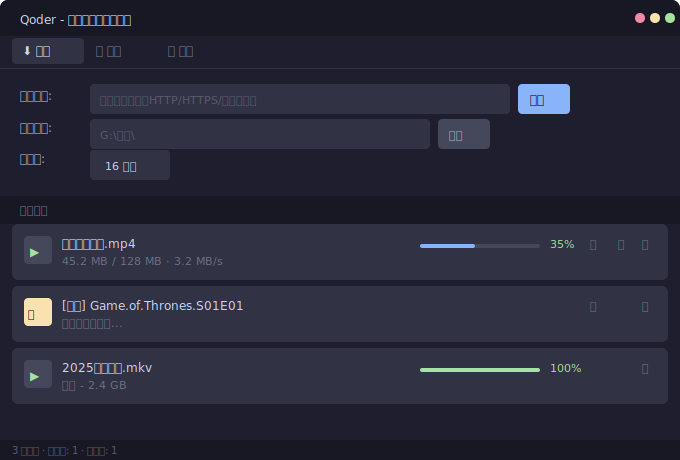
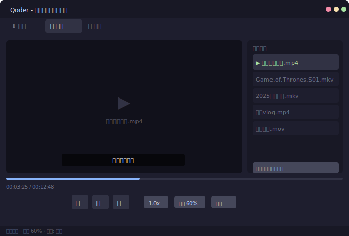
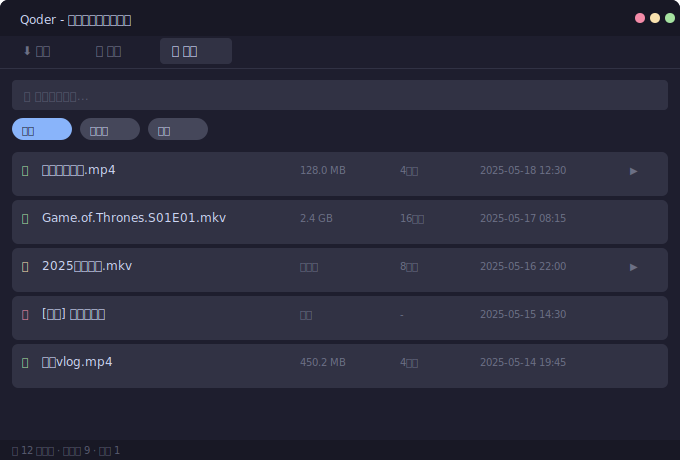

# FlashDL - 视频下载 & 播放工具

[](https://python.org)
[](https://pypi.org/project/PyQt6/)
[](LICENSE)

**FlashDL** 是一款开源的桌面视频下载与播放工具，支持 HTTP/HTTPS 多线程高速下载、磁力链接/BT 下载、本地视频播放，以及简洁的 PotPlayer 风格界面。

> 代码开源，结构清晰。适合作为 Python + PyQt6 桌面应用的学习参考项目。

## 界面预览

### 下载页

*多任务下载 · 实时速度 · 暂停/删除*

### 播放页

*视频播放 · 播放列表 · 字幕支持 · 倍速*

### 历史页

*搜索过滤 · 状态标记 · 历史记录*

---

## 功能特性

### ⬇️ 下载
- **多线程 HTTP 下载** — 自动检测 Range 支持，分片并行下载，充分利用带宽
- **断点续传** — 暂停/恢复，重启后自动恢复未完成的任务
- **批量导入** — 支持多行 URL 批量粘贴添加
- **磁力链接/BT 下载** — 基于 libtorrent 引擎，支持 DHT/PEX/公共 Tracker
- **下载队列** — 并发数量限制（默认 3），支持拖拽排序

### 🎬 播放
- 支持常见视频格式（MP4、MKV、AVI、MOV、FLV、WebM 等）
- 倍速播放（0.5x - 2.0x）
- 外挂字幕加载（SRT/ASS/SSA/VTT）、同步偏移调节
- 播放进度自动保存
- 播放列表持久化（退出后自动恢复）

### 🎨 界面
- PotPlayer 风格紧凑控制条（纯图标按钮）
- 深色/浅色双主题自适应
- 系统托盘支持

---

## 快速开始

### 环境要求

- Python 3.8+
- Windows 10/11（优先支持），macOS / Linux 亦可运行（字幕窗口功能受限）

### 安装

```bash
# 克隆仓库
git clone https://github.com/1371239533jkl/FlashDL.git
cd FlashDL

# 安装依赖
pip install -r requirements.txt

# 启动
python main.py
```

> ⚠️ **libtorrent** 编译安装较复杂，如遇安装失败，可先移除 libtorrent 相关行再安装：
> ```bash
> pip install PyQt6 requests pysubs2
> ```
> 移除后磁力下载不可用，HTTP 下载和播放功能不受影响。

### 打包为 exe

```bash
pip install pyinstaller
pyinstaller video_downloader.spec
```

产物在 `dist/` 目录下。

---

## 使用指南

### 📥 下载视频

```
① 复制视频直链（.mp4 /.mkv 等）
② 粘贴到下载链接框
③ 设置保存路径和线程数（可选）
④ 点击"添加"
```

### 🧲 磁力链接

```
① 复制磁力链接 (magnet:?xt=urn:btih:...)
② 粘贴到下载链接框
③ 点击"添加"
④ 等待元数据解析完成后自动开始下载
```

### 🎞️ 播放视频

```
① 拖拽或双击视频文件到播放列表
② 点击列表项开始播放
③ 右键列表可移除/清空
```

### 📝 字幕

- 自动加载同名字幕文件（.srt/.ass/.vtt）
- 点击"字幕"按钮加载外部字幕
- 字幕同步偏移调节（±0.5s 步进）

### 🌗 主题切换

标题栏右侧点击切换深色/浅色主题。

---

## 项目结构

```
FlashDL/
├── main.py                  # 应用入口
├── config.py                # 全局配置
├── requirements.txt         # Python 依赖
│
├── core/                    # 核心逻辑
│   ├── download_manager.py  #   下载管理器（调度、队列）
│   ├── download_task.py     #   HTTP 下载任务
│   ├── download_worker.py   #   下载工作线程（分块下载）
│   ├── url_validator.py     #   URL 验证与文件信息提取
│   ├── magnet_*.py          #   磁力链接/BT 下载
│   └── video_fetcher.py     #   网页视频嗅探（预留）
│
├── player/                  # 播放器模块
│   ├── video_player.py      #   视频播放封装
│   ├── subtitle_manager.py  #   字幕管理
│   ├── subtitle_widget.py   #   字幕覆盖窗口
│   └── playlist_manager.py  #   播放列表管理
│
├── ui/                      # 界面层
│   ├── main_window.py       #   主窗口
│   ├── player_tab.py        #   播放标签页
│   ├── download_tab.py      #   下载标签页
│   ├── history_tab.py       #   历史记录标签页
│   └── styles.py            #   主题样式
│
├── data/                    # 数据层
│   ├── database.py          #   SQLite 数据库
│   └── settings.py          #   设置持久化
│
└── utils/                   # 工具
    ├── format_utils.py      #   格式化工具
    └── signal_bus.py        #   全局信号总线
```

---

## 技术栈

| 模块 | 技术 |
|------|------|
| GUI 框架 | PyQt6 (Qt 6.6+) |
| HTTP 下载 | requests + 多线程分片 |
| BT/磁力 | libtorrent (2.0+) |
| 字幕解析 | pysubs2 |
| 数据持久化 | SQLite (sqlite3) + JSON |
| 视频播放 | QMediaPlayer (PyQt6) |
| 打包 | PyInstaller |

---

## 开发计划

- [x] 多线程 HTTP 下载
- [x] 断点续传
- [x] BT/磁力链接下载
- [x] 视频播放 + 字幕
- [x] 双主题支持
- [x] 下载队列管理
- [x] 播放列表持久化
- [ ] mpv 引擎替换（替代 QMediaPlayer）
- [ ] 批量任务操作（多选/全选）
- [ ] 百度网盘资源下载

---

## 常见问题

### libtorrent 安装失败
```bash
# Windows：安装预编译 DLL
pip install libtorrent-windows-dll

# 如仍失败，可跳过 libtorrent（磁力下载不可用，HTTP 下载正常）
pip install PyQt6 requests pysubs2
```

### 下载速度慢
- 检查是否为单线程下载（不支持 Range 的服务器只能单线程）
- 增加线程数（16-32 线程效果较好）
- CDN 链接有过期时间，长链接建议尽快下载

### 磁力链接解析卡住（一直在解析中）
- 等待元数据下载（需要连接 DHT 网络，首次可能较慢）
- 检查网络是否限制了 P2P 端口
- 可尝试重新添加任务

### 启动报错 `Failed to initialize libtorrent session`
```bash
# 检查是否已安装 libtorrent
pip list | findstr libtorrent

# 如未安装，按上面方法安装或跳过
```

### 打包 exe 太大
```bash
# 先删旧包，再重新打包
rm -rf dist build
pyinstaller video_downloader.spec
```

### 程序闪退/无响应
- 查看 `temp/` 目录下的日志文件
- 磁力下载时 BT 端口（默认 6881）可能被防火墙拦截
- 视频文件编码不兼容时，可尝试装 `K-Lite Codec Pack`

### GitHub 推送失败
```
fatal: unable to access '...': Failed to connect to github.com port 443
```
- 检查 hosts 文件是否有 GitHub 重定向（常见于 Steam++ / Watt Toolkit）
- 或切换为 SSH 方式推送

---

## 贡献

欢迎提交 Issue 或 Pull Request。

1. Fork 本仓库
2. 创建特性分支 (`git checkout -b feature/amazing`)
3. 提交改动 (`git commit -m 'Add amazing feature'`)
4. 推送到分支 (`git push origin feature/amazing`)
5. 发起 Pull Request

---

## 许可证

本项目基于 MIT 许可证开源。

## 致谢

- [libtorrent](https://libtorrent.org) — BT 下载引擎
- [PyQt6](https://riverbankcomputing.com/software/pyqt/) — Python Qt 绑定
- [requests](https://docs.python-requests.org) — HTTP 客户端
- [pysubs2](https://github.com/tomaarsen/pysubs2) — 字幕解析库
